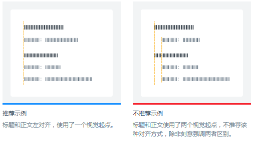
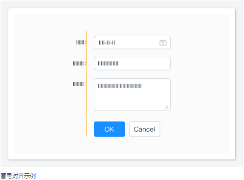
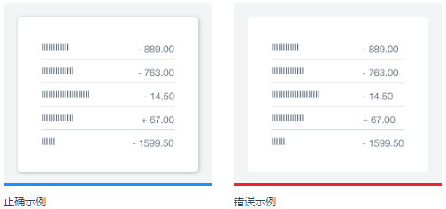

### 对齐

在界面设计中，将元素进行对齐，既符合用户的认知特性，也能引导视觉流向，让用户更流畅地接收信息。

----------

### 文案类对齐

如果页面的字段或段落较短、较散时，需要确定一个统一的视觉起点。

----------

### 表单类对齐

冒号对齐（右对齐）能让内容锁定在一定范围内，让用户眼球顺着冒号的视觉流，就能找到所有填写项，从而提高填写效率。

----------

### 数字类对齐

为了快速对比数值大小，建议所有数值取相同有效位数，并且右对齐。

