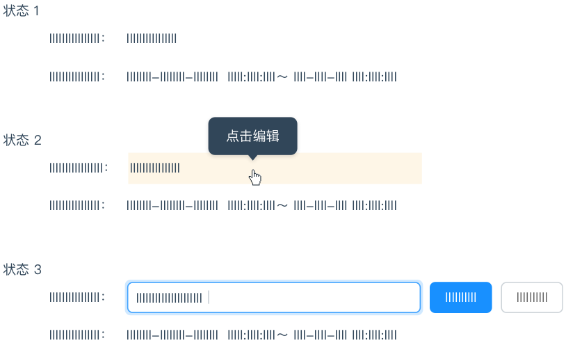

### 直截了当

『需要在哪里输出，就要允许在哪里输入』，不要为了编辑内容而打开另一个页面，应该直接在上下文中实现编辑。

### 页内编辑

单字段行内编辑

> 当『易读性』远比『易编辑性』重要时，可以使用『单击编辑』

单击编辑示例

* 状态一：普通的浏览模式，不区分可编辑行和不可编辑行；

* 状态二：鼠标悬停时，『指针』变为『手型』，编辑区域底色变黄，出现『Tooltips』提示单击编辑；

* 状态三：鼠标点击后，出现『输入框』、『确定』、『取消』表单元素，同时光标定位在『输入框』中。