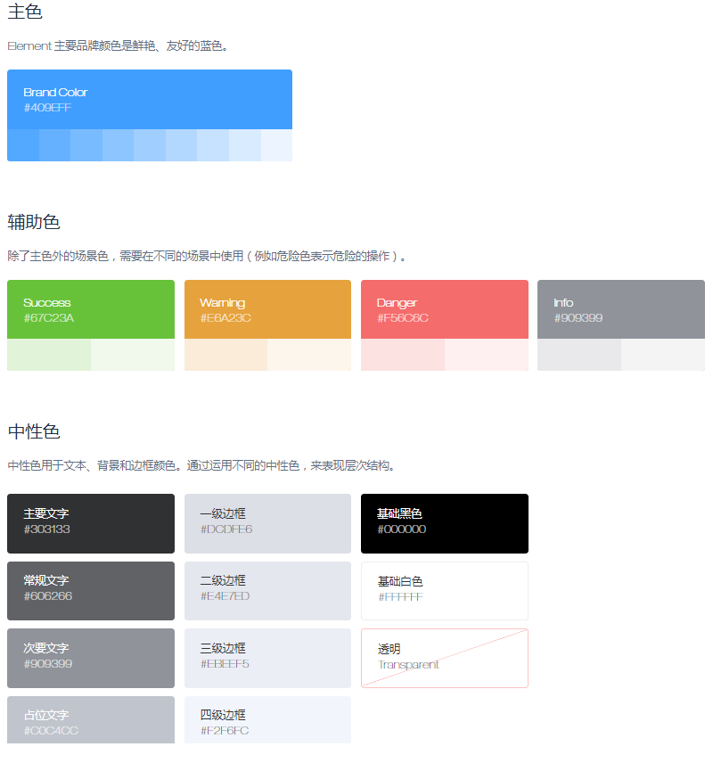

### 色彩

将色彩划分为两个层面：`系统级色彩`和`产品级色彩`

- 系统色彩：主要定义公司设计中的基础色板，所有产品中的基础色系皆遵取自系统色彩

- 产品色彩：在具体设计过程中，不同的产品线，基于系统色彩进一步定义符合产品调性以及功能诉求的颜色。

具体颜色设计可参考：  

[1.ElementUI](https://element.eleme.cn/2.12/#/zh-CN/component/color)

[2.Ant Design](https://ant.design/docs/spec/colors-cn)

### 建议

> 建立体系化的设计思路：在一个系统或者产品设计前，确定好整体的色系搭配，对主、次、辅助颜色进行提前规划。

例如下图：

